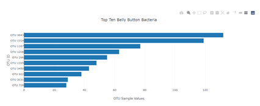

# Plotly_Belly_Button_Biodiversity

<<<<<<< HEAD
Using the dataset �Belly Button Biodiversity�, an interactive dashboard was created with user interaction in mind. The dataset catalogs microbes that colonize human navels.

The dataset reveals that a small handful of microbial species (also called operational taxonomic units, or OTUs, in the study) were present in more than 70% of people, while the rest were relatively rare.
Data was read in using d3 in order to build a dropdown menu and plot the top ten OTU�s on both a bar graph and a bubble chart. 
=======
Using the dataset “Belly Button Biodiversity”, I've created an interactive dashboard. The dataset catalogs microbes that colonize human navels.

The dataset reveals that a small handful of microbial species (also called operational taxonomic units, or OTUs, in the study) were present in more than 70% of people, while the rest were relatively rare.
I will read in the data using d3 in order to build a dropdown menu and plot the top ten OTU’s on both a bar graph and a bubble chart. 
>>>>>>> 37dd521db7b56ac7f5bd88d46a5f58e192313015

* Dashboard Home Page and Bubble Chart
  
  

* Bar Chart on Dashboard Home Page
  
  

